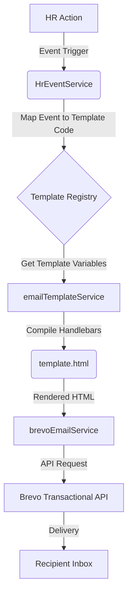

# Email System Implementation Summary (v2.0)

## ✅ Executive Summary

This document summarizes the complete overhaul of the TaskFlow HR Email System, delivered in **January 2026**. The system has been upgraded to a unified, variable-driven architecture using Handlebars and Brevo, supporting **20+ distinct email types** across the entire HR lifecycle.

---

## 📦 Key Deliverables

### 1. **Unified Template Engine** (`template.html`)
- ✅ **Single Source of Truth**: One master HTML file serving all 20+ email types.
- ✅ **Handlebars Integration**: Dynamic variable injection and logic.
- ✅ **Conditional Rendering**: Boolean flags (`show_details`, `show_highlight`, `show_cta`) control layout.
- ✅ **Responsive Design**: Mobile-first, dark-themed, and cinematic UI.
- ✅ **Brand Consistency**: Professional Code Catalyst branding.

### 2. **Expanded Template Library** (20+ Templates)
Complete coverage of HR workflows, organized by category:

| Category | Email Types | Status |
|---|---|---|
| **Hiring** | `HIRING_APPLIED`, `NOT_HIRED` (Rejection) | ✅ Active |
| **Interview** | `INTERVIEW_ONLINE`, `INTERVIEW_OFFLINE`, `INTERVIEW_RESCHEDULED`, `INTERVIEW_NO_SHOW` | ✅ Active |
| **Onboarding** | `HIRED` (Offer), `TEAM_CHOICE_INTERVIEWED`, `TEAM_CHOICE_NOT_INTERVIEWED`, `WELCOME` | ✅ Active |
| **Engagement** | `SERVER_JOIN_REMINDER`, `INACTIVITY_WARNING`, `REJOIN_INVITE` | ✅ Active |
| **Exit** | `RESIGNATION_ACK`, `TERMINATION_NOTICE` | ✅ Active |
| **Leave** | `LEAVE_APPROVED`, `LEAVE_REJECTED` | ✅ Active |
| **Attendance** | `ATTENDANCE_REMINDER` | ✅ Active |
| **System** | `CONTACT_ACK`, `TASK_ASSIGNMENT`, `ANNOUNCEMENT` | ✅ Active |

### 3. **Backend Services**
- **`emailTemplateService.js`**: Handlebars compilation and rendering engine.
- **`brevoEmailService.js`**: Enhanced Brevo API wrapper for transactional sending.
- **`hrActionService.js` / `hrEventService.js`**: Business logic mapping HR events to email templates.

### 4. **Frontend Integration** (HR Dashboard)
- ✅ **Visual Template Center**: Organized by category with color-coded badges.
- ✅ **Dynamic Icons**: Category-specific icons (UserPlus, MessageSquare, etc.).
- ✅ **Preview Capabilities**: Direct template selection and triggering.

---

## 🔧 Technical Architecture

### Core Components
1.  **Template Registry**: Maps event codes (e.g., `INTERVIEW_ONLINE`) to required variables.
2.  **Conditional Flags**:
    - `show_details`: Displays structured data tables (Date, Time, Venue).
    - `show_highlight`: Renders alert/warning blocks.
    - `show_cta`: Renders action buttons.
    - `show_social_links`: Appends social media footer.

---

## 📊 Impact & Benefits

| Feature | Before (v1.0) | After (v2.0) |
|---|---|---|
| **Template Management** | Multiple scattered HTML files | **Single `template.html`** |
| **Maintenance** | Manual edits for every change | **Change once, update all** |
| **Coverage** | Basic workflows (~11 types) | **Full lifecycle (20+ types)** |
| **Design** | Basic styling | **Cinematic, Gradient UI** |
| **Integration** | Nodemailer (basic) | **Brevo API (Enterprise)** |
| **Scalability** | Low | **High (Config definitions)** |

---

## 🚀 Implementation Details

### Deployment
- **Date**: January 22, 2026
- **Version**: 2.0.0
- **Environment**: Production

### Critical Files
- `backend/templates/email/template.html`
- `backend/scripts/seedEmailTemplates.js`
- `backend/services/emailTemplateService.js`
- `frontend/src/pages/HRDashboard.jsx`

---

## ✅ Status
**Production Ready**. All 20 templates are seeded, services are deployed, and the HR Dashboard is fully integrated.

For detailed documentation, refer to:
- `UNIFIED_EMAIL_SYSTEM.md` (System Guide)
- `API_REFERENCE_HR_MODULE.md` (API Docs)
